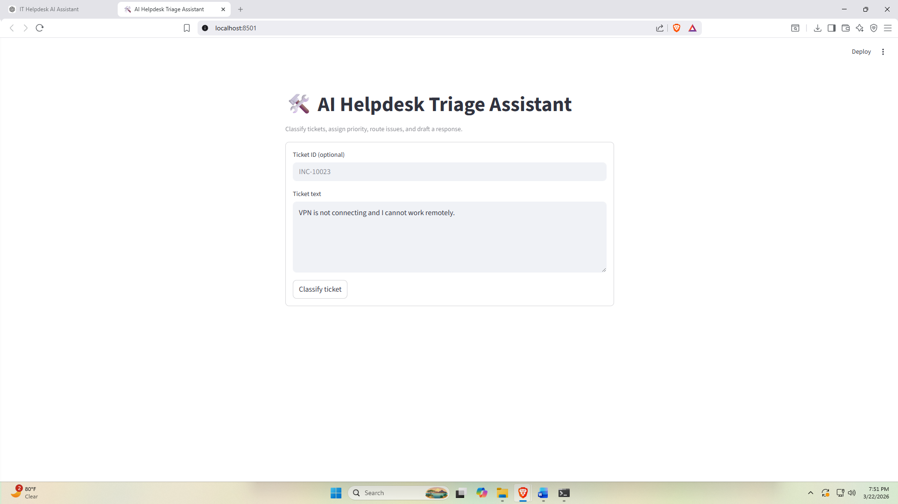
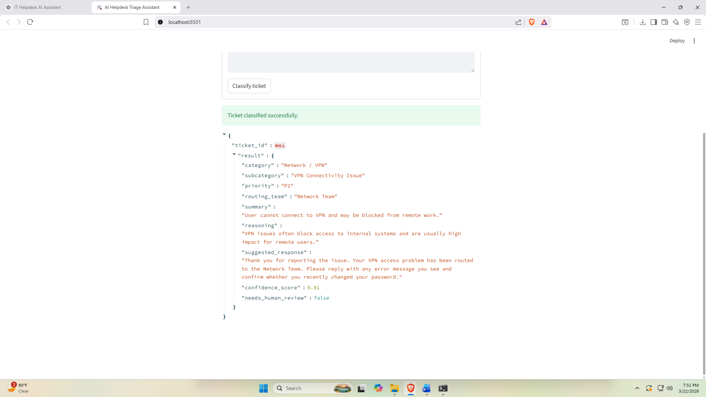
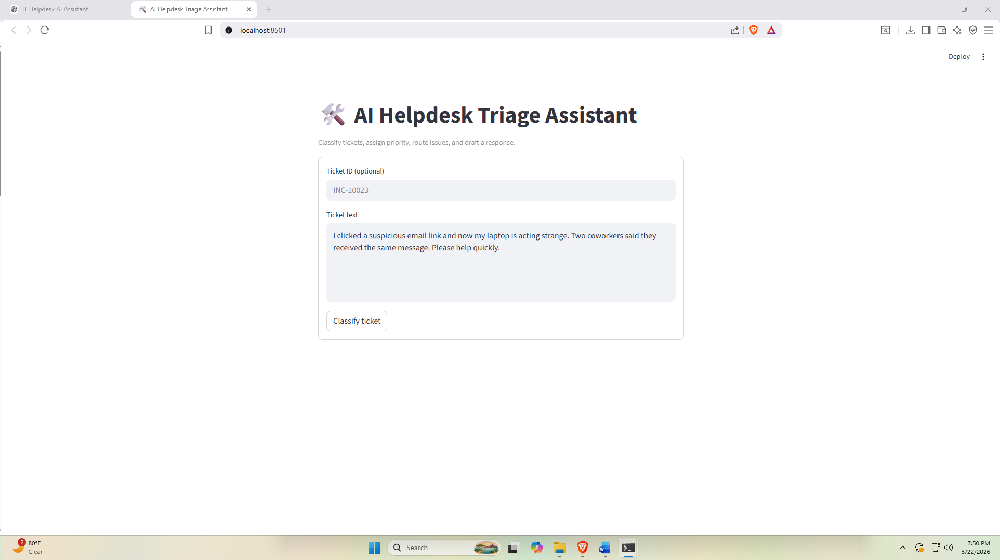
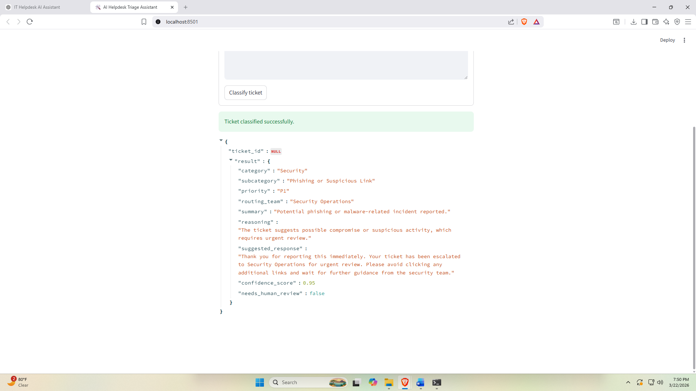

# 🚀 AI IT Helpdesk Triage Assistant

## 📊 Expected Impact

- Reduces manual ticket triage time by ~60–80%
- Improves routing accuracy through consistent classification
- Accelerates response time with AI-generated replies
- Enables scalable IT helpdesk automation

An AI-powered IT helpdesk assistant that automates ticket triage, classification, prioritization, routing, and response generation.

This project demonstrates how Large Language Models (LLMs) can be applied to real-world IT Service Management (ITSM) workflows to reduce manual effort and improve response times.

---

## 📌 Problem

IT helpdesks often face:

- Slow ticket triage
- Misrouted incidents
- Inconsistent prioritization
- Delayed response times

Manual triage creates bottlenecks and reduces service efficiency.

---

## 💡 Solution

This system uses an AI model or a zero-cost local demo mode to:

- Classify incoming tickets
- Assign priority (P1–P4)
- Route to the correct support team
- Generate a suggested response
- Output structured JSON for system integration

---

## 🧠 Key Features

- Automated ticket classification (category + subcategory)
- Priority assignment using business impact rules
- Intelligent routing to IT teams
- AI-generated response suggestions
- Structured JSON output for downstream systems
- Zero-cost demo mode with no API required
- FastAPI backend and Streamlit UI
- Clean project structure for portfolio presentation

---

## 🏗️ Architecture

```text
User Input (Ticket)
        ↓
FastAPI Backend
        ↓
Triage Service (LLM or Mock Mode)
        ↓
Structured JSON Output
        ↓
UI Display / Future ITSM Integration
```

---

## 🧰 Tech Stack

- Python
- FastAPI
- Pydantic
- Streamlit
- OpenAI API (optional)
- Docker (optional)

---

## 🖥️ Demo

This system demonstrates real-time AI-driven IT ticket triage using a zero-cost local inference mode.

### 🔹 Ticket Classification (Network Issue)

**Input**
```text
VPN is not connecting and I cannot work remotely.
```

**UI View**



**Result**



---

### 🔹 Ticket Classification (Security Incident)

**Input**
```text
I clicked a suspicious email link and now my laptop is acting strange. Two coworkers said they received the same message. Please help quickly.
```

**UI View**



**Result**



---

## 🆓 Zero-Cost Demo Mode

This project includes a mock classification engine, allowing it to run without any external API costs.

### How it works
- If no OpenAI API key is provided, the app uses rule-based classification
- The UI and API contract remain the same
- This makes the project ideal for demos, interviews, and local testing

---

## ⚙️ Setup & Installation

### 1. Clone the repo

```bash
git clone https://github.com/Solo30657/ai-helpdesk-assistant.git
cd ai-helpdesk-assistant
```

### 2. Create environment file

```bash
copy .env.example .env
```

Leave this empty for free mode:

```env
OPENAI_API_KEY=
```

### 3. Install dependencies

```bash
python -m pip install -r requirements.txt
```

### 4. Run backend

```bash
python -m uvicorn app.main:app --reload
```

### 5. Run UI

```bash
python -m streamlit run ui/streamlit_app.py
```

---

## 🔌 API Endpoint

### POST `/classify`

**Request**
```json
{
  "ticket": "My laptop keeps restarting randomly"
}
```

**Response**
```json
{
  "ticket_id": null,
  "result": {
    "category": "Hardware",
    "subcategory": "Laptop or Desktop Issue",
    "priority": "P2",
    "routing_team": "Desktop Support",
    "summary": "User reported a device stability or hardware issue.",
    "reasoning": "The ticket suggests a hardware problem that may block productivity.",
    "suggested_response": "Thank you for reporting the device issue. Your ticket has been routed to Desktop Support for review.",
    "confidence_score": 0.88,
    "needs_human_review": false
  }
}
```

---

## 🧪 Sample Test Tickets

- I clicked a suspicious email link
- VPN is not working
- I need access to a shared drive
- My laptop keeps crashing

---

## 🧠 Design Decisions

- Used structured JSON output for reliable downstream integration
- Implemented schema validation with Pydantic
- Added zero-cost mock mode for local demos and interview readiness
- Built the project API-first to support future ServiceNow or Jira integrations
- Kept the ticket taxonomy explicit to improve consistency and reduce ambiguity

---

## 📈 Future Improvements

- Retrieval-augmented generation (RAG) with a helpdesk knowledge base
- SLA prediction
- Sentiment analysis
- Multi-ticket batch processing
- ServiceNow / Jira Service Management integration
- Human-in-the-loop escalation workflows

---

## 🤝 Contributing

Feel free to fork, improve, and extend the project.

---

## 📬 Contact

If you'd like to discuss this project or collaborate, feel free to reach out.
